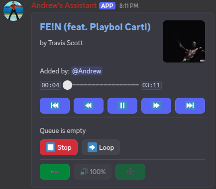

# Assistant.Net

This is a multipurpose Discord bot built using C# and the .NET platform. This used to be in
python [andrew264/Assistant](https://github.com/andrew264/Assistant).

## Features

Assistant.Net comes packed with features designed for my server.

* **Music System**
    * High-quality audio playback using Lavalink.
    * Support for YouTube and Spotify.
    * Persistent user playlists that can be created, shared, and modified.
    * Interactive "Now Playing" controls for easy playback management.
    * Audio filters like bass boost, nightcore, and vaporwave.
    * Lyrics fetching from Genius.

* **Interactive Games**
    * Play games like Tic-Tac-Toe, Rock Paper Scissors, and Hand Cricket against other users or the bot.
    * Tracks user stats and leaderboards for each game within the server.

* **Information Commands**
    * Detailed user, server, and bot information panels.
    * Avatar viewer for any user.

* **Fun and Miscellaneous**
    * Fetch posts from Reddit, including memes and other content from configurable subreddits.
    * Look up definitions on Urban Dictionary.
    * Simple commands like a PP size checker and a relationship "FLAMES" game.

* **Utility and Moderation**
    * Set personal or channel-wide reminders with recurrence options.
    * A fully functional Starboard system to highlight popular messages.
    * Message clearing and purging tools for administrators.
    * DM relay for the bot owner to communicate with users through the bot.

## Gallery

<table style="width: 100%; table-layout: fixed; text-align: center;">
  <tr>
    <td style="width: 33%;">
      <strong>Rock Paper Scissors</strong><br>
      
    </td>
    <td style="width: 33%;">
      <strong>Tic-Tac-Toe</strong><br>
      
    </td>
    <td style="width: 33%;">
      <strong>Game Leaderboard</strong><br>
      
    </td>
  </tr>
  <tr>
    <td style="width: 33%;">
      <strong>Bot Info</strong><br>
      
    </td>
    <td style="width: 33%;">
      <strong>Now Playing</strong><br>
      
    </td>
    <td style="width: 33%;">
      <strong>User Info</strong><br>
      
    </td>
  </tr>
</table>

## Getting Started

To run your own instance of Assistant.Net, you'll need to follow these steps.

### Prerequisites

* .NET 9 SDK (or the version specified in `Assistant.Net.csproj`)
* A running Lavalink server for music functionality.
* A MongoDB database for storing data.
* A Discord Bot Token and various API keys.

### Installation

1. Clone the repository:
   ```sh
   git clone https://github.com/andrew264/Assistant.Net.git
   cd Assistant.Net
   ```

2. Configure the bot by creating your own `config.yaml` file. You can start by copying the `example.yaml`:
   ```sh
   cp Configuration/example.yaml Configuration/config.yaml
   ```

3. Fill in the `Configuration/config.yaml` with your own tokens, keys, and database credentials. See the Configuration
   section below for more details.

4. Build and run the project:
   ```sh
   dotnet run
   ```

## Configuration

The bot's behavior is controlled by the `Configuration/config.yaml` file. Here are the main sections you'"'"'ll need to
set up:

* **client**: Contains essential Discord bot settings like the token, owner ID, command prefix, and the category for DM
  relay channels.
* **mongo**: Your MongoDB connection details. You can use a full connection string or provide the username, password,
  and URL separately.
* **lavalink**: Credentials for your Lavalink server, which is required for all music features.
* **reddit**: API credentials for a Reddit application if you want to use the Reddit commands. You can also configure
  the subreddits for the meme and NSFW commands here.
* **geniusToken**: An API token from Genius for fetching song lyrics.
* **loggingGuilds**: Configure channels where the bot should log server events like message edits, deletions, and member
  updates.

## Technology Stack

* **Framework:** .NET 9
* **Discord API Wrapper:** [Discord.Net](https://github.com/discord-net/Discord.Net)
* **Music:** [Lavalink](https://github.com/lavalink-devs/Lavalink)
* **Database:** [MongoDB](https://www.mongodb.com/) with the official C# driver.

## Contributing

If you find a bug or have a suggestion, feel free to open an issue. Pull requests are also welcome.